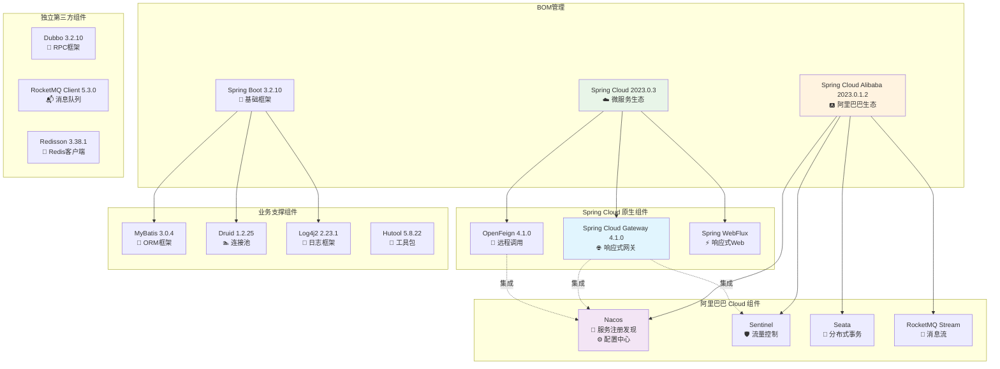

# Back-End Scaffolding

> 🚀 基于Spring Boot 3.x + Spring Cloud 2023.x + Spring Cloud Alibaba 的企业级后端脚手架

## 📋 项目简介

本项目是一个现代化的微服务后端脚手架，集成了Spring Cloud生态和阿里巴巴微服务组件，提供了完整的企业级开发基础设施。

### 🏗️ 核心特性

- **🔧 模块化设计**：清晰的模块划分，支持独立开发和部署
- **☁️ 微服务架构**：基于Spring Cloud Gateway + Nacos + Sentinel的微服务解决方案  
- **🛡️ 安全可靠**：集成SA-Token权限框架，支持分布式会话管理
- **📊 可观测性**：统一日志管理、链路追踪、监控告警
- **🔄 高可用**：分布式锁、熔断限流、事务一致性保障
- **🤖 AI能力**：集成Spring AI，支持大模型应用开发

## 🏢 工程简介

| 工程模块 | 功能描述 | 默认端口 | 启动方式 |
|:---------|:---------|:---------|:---------|
| **server-parent** | 父工程，全局依赖管理 | / | / |
| **server-common** | 公共模块，通用组件 | / | / |
| **server-main** | 主工程，脚手架核心 | 28920 | 常规启动 |
| **server-api** | 网关服务 | 28922 | 常规启动 |
| **server-auth** | 权限服务 | 28927 | 常规启动 |
| **server-ai** | AI服务 | 28928 | 常规启动 |

### 🧰 基础设施

| 组件 | 描述 | 默认端口 | 启动方式 |
|:-----|:-----|:---------|:---------|
| **MySQL** | 关系型数据库 | 3306 | 跟随系统 |
| **Redis** | 缓存数据库 | 6379 | `redis-server` |
| **Nacos** | 注册中心+配置中心 | 8848 | Docker或独立部署 |
| **MinIO** | 对象存储 | 9000 | `./minio server data` |
| **MongoDB** | 文档数据库 | 27017 | 跟随系统 |
| **Elasticsearch** | 搜索引擎 | 9200 | `./bin/elasticsearch` |
| **RocketMQ** | 消息队列 | 9876/10911 | NameServer + Broker |

## 🛠️ 技术栈

### 核心框架

| 技术组件 | 版本 | 说明 | 官网 |
|:---------|:-----|:-----|:-----|
| **Spring Boot** | 3.2.10 | 基础开发框架 | [spring.io](https://spring.io/projects/spring-boot) |
| **Spring Cloud** | 2023.0.3 | 微服务生态 | [spring.io](https://spring.io/projects/spring-cloud) |
| **Spring Cloud Alibaba** | 2023.0.1.2 | 阿里巴巴微服务组件 | [github.com](https://github.com/alibaba/spring-cloud-alibaba) |
| **Spring Cloud Gateway** | 4.1.0 | 响应式网关 | [spring.io](https://spring.io/projects/spring-cloud-gateway) |

### 数据层技术

| 技术组件 | 版本 | 说明 | 官网 |
|:---------|:-----|:-----|:-----|
| **MyBatis** | 3.0.4 | ORM框架 | [mybatis.org](https://mybatis.org/) |
| **Druid** | 1.2.25 | 数据库连接池 | [github.com](https://github.com/alibaba/druid) |
| **Redis** | - | 缓存中间件 | [redis.io](https://redis.io/) |
| **Redisson** | 3.38.1 | Redis分布式客户端 | [redisson.org](https://redisson.org/) |

### 微服务组件

| 技术组件 | 版本 | 说明 | 官网 |
|:---------|:-----|:-----|:-----|
| **Nacos** | - | 服务注册发现+配置中心 | [nacos.io](https://nacos.io/) |
| **Sentinel** | - | 流量控制+熔断降级 | [sentinelguard.io](https://sentinelguard.io/) |
| **Seata** | - | 分布式事务 | [seata.io](https://seata.io/) |
| **OpenFeign** | 4.1.0 | 声明式HTTP客户端 | [spring.io](https://spring.io/projects/spring-cloud-openfeign) |

### 消息队列

| 技术组件 | 版本 | 说明 | 官网 |
|:---------|:-----|:-----|:-----|
| **RocketMQ** | 5.3.0 | 分布式消息队列 | [rocketmq.apache.org](https://rocketmq.apache.org/) |
| **Kafka** | - | 分布式流处理平台 | [kafka.apache.org](https://kafka.apache.org/) |

### 工具组件

| 技术组件 | 版本 | 说明 | 官网 |
|:---------|:-----|:-----|:-----|
| **SA-Token** | 1.43.0 | 权限认证框架 | [sa-token.cc](https://sa-token.cc/) |
| **Hutool** | 5.8.22 | Java工具类库 | [hutool.cn](https://hutool.cn/) |
| **FastJSON2** | 2.0.42 | JSON处理框架 | [github.com](https://github.com/alibaba/fastjson2) |
| **Swagger** | 2.2.12 | API文档框架 | [swagger.io](https://swagger.io/) |
| **Log4j2** | 2.23.1 | 日志框架 | [logging.apache.org](https://logging.apache.org/log4j/2.x/) |

### AI & 大模型

| 技术组件 | 版本 | 说明 | 官网 |
|:---------|:-----|:-----|:-----|
| **Spring AI** | 1.0.0 | Spring AI框架 | [spring.io](https://spring.io/projects/spring-ai) |
| **Milvus** | 2.3.4 | 向量数据库 | [milvus.io](https://milvus.io/) |

## 📊 项目依赖关系图

### 架构依赖总览



### 📋 版本兼容性说明

| 组件类型 | 版本管理方式 | 说明 |
|---------|-------------|------|
| **Spring Cloud** | BOM统一管理 | Gateway、OpenFeign等由Spring Cloud BOM管理 |
| **Spring Cloud Alibaba** | BOM统一管理 | Nacos、Sentinel、Seata等由阿里BOM管理 |
| **独立组件** | 手动版本管理 | Dubbo、RocketMQ等需要独立维护版本兼容性 |
| **Spring Boot** | Parent管理 | 基础组件由spring-boot-starter-parent管理 |

### 🎯 关键设计决策

1. **网关选择**：采用Spring Cloud Gateway而非自研，与阿里巴巴生态深度集成
2. **服务发现**：Nacos作为统一的服务注册中心和配置中心
3. **流量控制**：Sentinel提供熔断、限流、降级能力
4. **分布式事务**：Seata保证分布式事务一致性
5. **消息队列**：RocketMQ支持事务消息和顺序消息

## 🚀 快速开始

### 环境要求

- JDK 17+
- Maven 3.8+
- MySQL 8.0+
- Redis 6.0+

### 启动步骤

1. **克隆项目**
   ```bash
   git clone <repository-url>
   cd back-end-scaffolding
   ```

2. **启动基础设施**
   ```bash
   # 启动MySQL、Redis、Nacos等基础组件
   ```

3. **编译项目**
   ```bash
   mvn clean install
   ```

4. **启动服务**
   ```bash
   # 启动主服务
   cd server-main && mvn spring-boot:run
   
   # 启动网关
   cd server-api && mvn spring-boot:run
   
   # 启动权限服务  
   cd server-auth && mvn spring-boot:run
   ```

## 📚 文档说明

- 🏗️ [架构设计文档](./wiki/) - 详细的系统架构和设计说明
- 🔧 [开发指南](./wiki/) - 开发规范和最佳实践
- 📝 [API文档](http://localhost:28920/swagger-ui.html) - 在线API文档

## 🤝 贡献指南

欢迎提交Issue和Pull Request，详细规范请参考贡献指南。

## 📄 许可证

本项目采用 MIT 许可证，详情请查看 [LICENSE](LICENSE) 文件。


